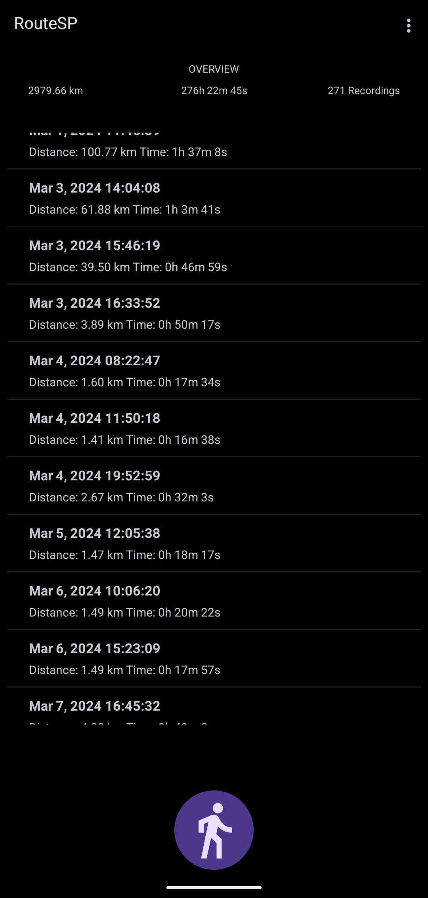
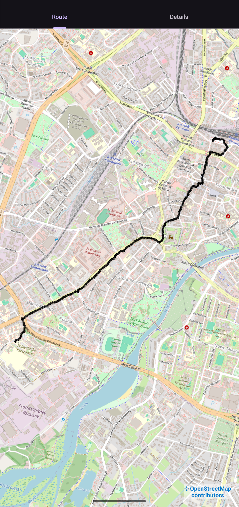
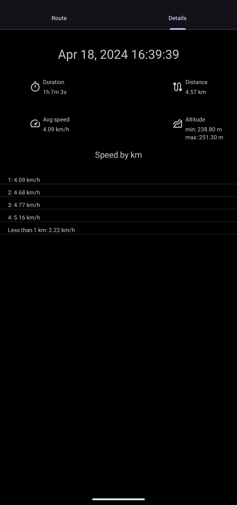

#  RouteSP

An Android app for GPS‑based route tracking and recording utilizing [osmdroid](https://github.com/osmdroid/osmdroid) for maps.

## Preview

## Features

 - Live statistics during recording
 - Recording pausing - suspend recording without losing progress
 - Overwiew: cumulative distance, total time, and number of recordings, plus a detailed list of recordings
 - Theme control
 - Support for AMOLED dark
 - Unit toggling - switch between meters/kilometers for distance and between m/s / km/h for speed
 - Real‑time notification - notification that shows current speed, total distance, and elapsed time
 - Exporting and importintg routes from JSON files
 - Each route route can be preview on the map with details such as: duration, distance, avg speed, max and min altutite and speed by km

## Building

The application is not currently distributed.
To build and run it, clone the repository, open the project in Android Studio, and build and install it on an Android device or emulator.

## License

This project is licensed under [Apache-2.0](LICENSE) License.
